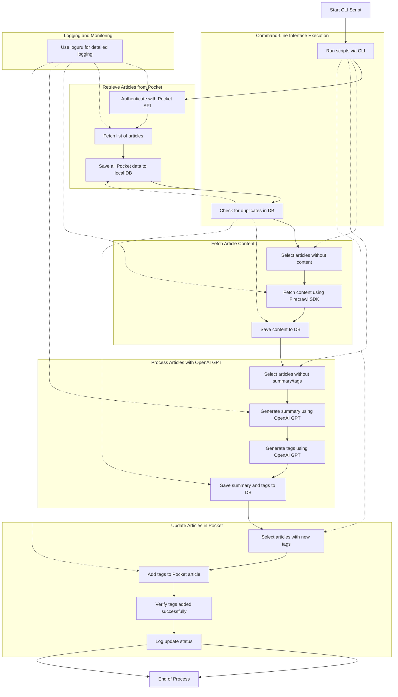

# Pocket to the ChatGPT

This tool fetches articles from Pocket, summarizes them using OpenAI GPT-4, generates tags, and updates the articles in Pocket with these tags. All data is stored locally in a SQLite database.

## Features

- Retrieve and store all data from Pocket.
- Fetch article content using Firecrawl SDK.
- Generate summaries and tags using OpenAI GPT-4.
- Update Pocket articles with new tags.
- Modular CLI execution for each step.

## Data Flow

1. **Retrieve Articles from Pocket**: Fetch all articles and save all available data to the local database.
2. **Fetch Article Content**: Use Firecrawl SDK to scrape and store article content.
3. **Process Articles with OpenAI GPT**: Generate summaries and tags, storing them in the database.
4. **Update Articles in Pocket**: Add the generated tags to each article in Pocket.
5. **CLI Execution**: Run each step separately via CLI commands, with duplicate checks to avoid reprocessing.

### **Diagram Explanation**

- **Start CLI Script**: The entry point when you run the script from the command line.

- **Retrieve Articles from Pocket**:

  - **A1**: Authenticate with the Pocket API using your consumer key and access token.
  - **A2**: Fetch a complete list of articles, including all available data.
  - **A3**: Save all retrieved Pocket data to the local SQLite database.

- **Command-Line Interface Execution**:

  - **E1**: Allows you to run each major function separately via CLI commands.
  - **E2**: Checks for duplicates and existing information in the database to prevent redundant processing.

- **Fetch Article Content**:

  - **B1**: Select articles from the database that do not have content fetched yet.
  - **B2**: Fetch article content using the Firecrawl SDK.
  - **B3**: Save the fetched content back to the database.

- **Process Articles with OpenAI GPT**:

  - **C1**: Select articles that have content but lack summaries or tags.
  - **C2**: Generate a summary of the article using OpenAI GPT.
  - **C3**: Generate relevant tags based on the article content using OpenAI GPT.
  - **C4**: Save the generated summaries and tags to the database.

- **Update Articles in Pocket**:

  - **D1**: Select articles that have new tags not yet updated in Pocket.
  - **D2**: Add the generated tags to each article in Pocket (mandatory step).
  - **D3**: Verify that the tags have been successfully added.
  - **D4**: Log the status of the update for each article.

- **Logging and Monitoring**:

  - **F1**: Use the `loguru` library to log important events, errors, and the overall progress throughout the process.

- **End of Process**: Marks the completion of the workflow.
